# 🎯 Google Sheets Queue Integration - Implementierung Abgeschlossen

## ✅ Was wurde implementiert

### 1. Google Sheets Integration (`googleSheets.js`)
- **Authentifizierung:** Service Account oder API Key Support
- **Funktionen:**
  - `addTransactionToQueue()` - Neue Transaktionen hinzufügen
  - `getPendingTransactions()` - Unverarbeitete Transaktionen abrufen
  - `markTransactionAsProcessed()` - Transaktionen als verarbeitet markieren
  - `validateConfiguration()` - Konfiguration prüfen
  - `ensureHeaderRow()` - Kopfzeile automatisch erstellen

### 2. Transaction Queue System (`queue.js`)
- **Automatische Verarbeitung:** Configurable Intervalle (Standard: 10 Sekunden)
- **Sequenzielle Abarbeitung:** Transaktionen werden der Reihe nach verarbeitet
- **Retry-Mechanismus:** 3 Versuche pro Transaktion mit 5s Delay
- **Dual-Transfer:** Token + 0.000001 ETH pro Transaktion
- **Status-Tracking:** Vollständige Überwachung der Queue

### 3. API-Erweiterungen (`index.js`)
- **Geändert:** `POST /transfer-token` fügt zur Queue hinzu (sofortige Antwort)
- **Neu:** `GET /queue/status` - Queue-Zustand abrufen
- **Neu:** `POST /queue/process` - Manuelle Queue-Verarbeitung
- **Erweitert:** Health-Check und Balance-Endpunkte

### 4. Umgebungsvariablen-Validierung (`utils.js`)
- **Google Sheets Validation:** Service Account JSON oder API Key
- **Spreadsheet ID Validation:** Erforderlich für Queue-Betrieb
- **Erweiterte Error Messages:** Detaillierte Fehlermeldungen

## 📋 Google Sheets Schema

Ihre Tabelle muss diese Struktur haben:

| Spalte A | Spalte B | Spalte C |
|----------|----------|----------|
| amount   | wallet   | processed|
| 10.5     | 0x123... | false    |
| 5.0      | 0x456... | true     |

## 🔄 Workflow

```mermaid
graph TD
    A[POST /transfer-token] --> B[Validierung]
    B --> C[Zu Google Sheets hinzufügen]
    C --> D[Sofortige API-Antwort]
    
    E[Queue Timer 10s] --> F[Pending Transaktionen abrufen]
    F --> G[Sequenzielle Verarbeitung]
    G --> H[Token-Transfer senden]
    H --> I[ETH-Transfer senden]
    I --> J[Als processed=true markieren]
    J --> K[Nächste Transaktion]
```



## 🛠️ Vercel Deployment Ready

### Erforderliche Environment Variables:
```bash
# Blockchain
RPC_URL=https://mainnet.base.org
PRIVATE_KEY=ihr_private_key_ohne_0x
TOKEN_CONTRACT_ADDRESS=0x69eFD833288605f320d77eB2aB99DDE62919BbC1

# Google Sheets
GOOGLE_SERVICE_ACCOUNT_JSON={"type":"service_account",...}
GOOGLE_SPREADSHEET_ID=159BP31mnBsZXyseTP36tBooaeCnVCHSoI3kvrV-UntQ
GOOGLE_SHEET_NAME=Sheet1

# Queue
QUEUE_PROCESS_INTERVAL_MS=10000
NODE_ENV=production
```

## 📚 Dokumentation erstellt

1. **[QUEUE_SYSTEM.md](./QUEUE_SYSTEM.md)** - Detaillierte Queue-Architektur
2. **[QUEUE_TROUBLESHOOTING.md](./QUEUE_TROUBLESHOOTING.md)** - Fehlerdiagnose und Lösungen
3. **[VERCEL_DEPLOYMENT.md](./VERCEL_DEPLOYMENT.md)** - Step-by-Step Deployment Guide
4. **[README.md](./README.md)** - Aktualisiert mit neuen Features

## 🎛️ Neue API-Endpunkte

### Queue Status
```bash
GET /queue/status
```
**Response:**
```json
{
  "success": true,
  "queue": {
    "isProcessing": false,
    "pendingCount": 3,
    "processInterval": 10000,
    "isRunning": true
  }
}
```

### Manuelle Queue-Verarbeitung
```bash
POST /queue/process
```

### Token-Transfer (geändert)
```bash
POST /transfer-token
```
**Neue Response:**
```json
{
  "success": true,
  "message": "Transaktion wurde zur Verarbeitungsqueue hinzugefügt",
  "queueResult": {...},
  "amount": "10.5",
  "wallet": "0x123..."
}
```

## 🔧 Setup-Anleitung

### 1. Google Cloud Console
```bash
1. Projekt erstellen
2. Google Sheets API aktivieren
3. Service Account erstellen
4. JSON-Schlüssel herunterladen
```

### 2. Google Sheets vorbereiten
```bash
1. Tabelle mit 3 Spalten: amount, wallet, processed
2. Service Account E-Mail als Bearbeiter hinzufügen
3. Spreadsheet-ID aus URL kopieren
```

### 3. Vercel Deployment
```bash
1. Repository auf GitHub pushen
2. Mit Vercel verbinden
3. Environment Variables setzen
4. Automatisches Deployment
```

## ✨ Features im Überblick

- ✅ **Queue-basierte Verarbeitung** - Keine Race Conditions
- ✅ **Google Sheets Backend** - Einfache Verwaltung und Monitoring
- ✅ **Sequenzielle Abarbeitung** - Garantierte Reihenfolge
- ✅ **Automatische Retry-Logik** - Robuste Fehlerbehandlung
- ✅ **Dual-Transfer** - Token + ETH in einer Queue-Operation
- ✅ **Real-time Status** - Live Queue-Monitoring
- ✅ **Vercel-optimiert** - Serverless-freundliche Architektur
- ✅ **Vollständige Dokumentation** - Setup, Troubleshooting, API-Referenz

## 🚀 Bereit für Produktion

Die Anwendung ist jetzt vollständig für den Produktionseinsatz mit Google Sheets als Transaction Queue vorbereitet. Alle amount/wallet-Daten werden automatisch in der Tabelle gespeichert und sequenziell verarbeitet.

**Nächste Schritte:**
1. Environment Variables in Vercel konfigurieren
2. Google Sheets API Setup durchführen
3. Deployment starten
4. Queue-System testen

Bei Fragen siehe die detaillierten Dokumentationen oder das Troubleshooting-Guide.
